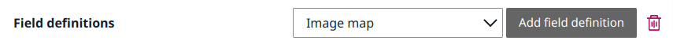
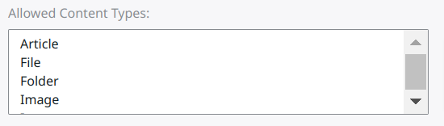
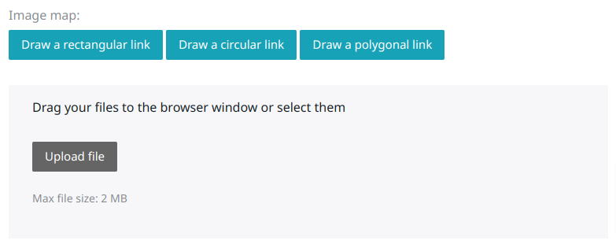
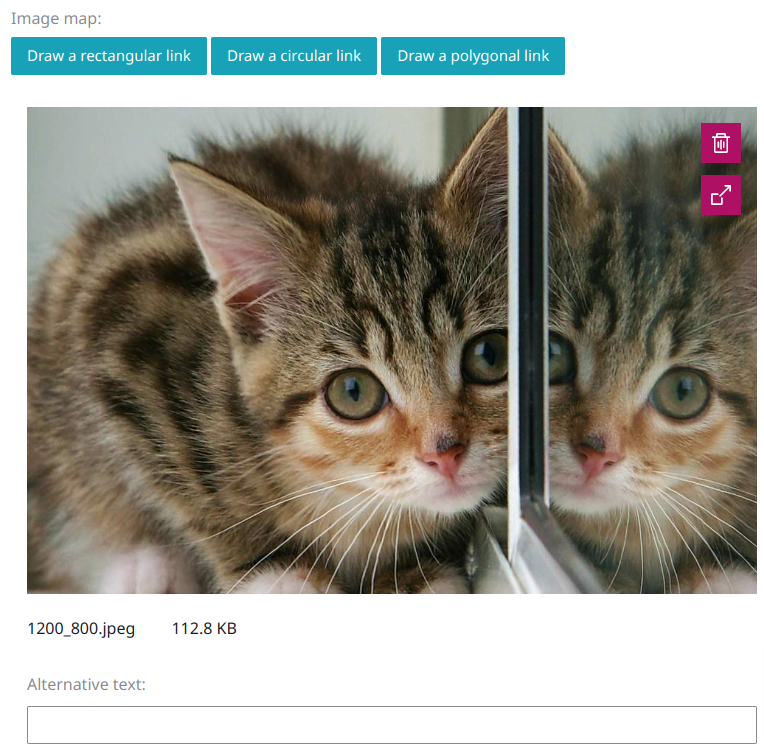
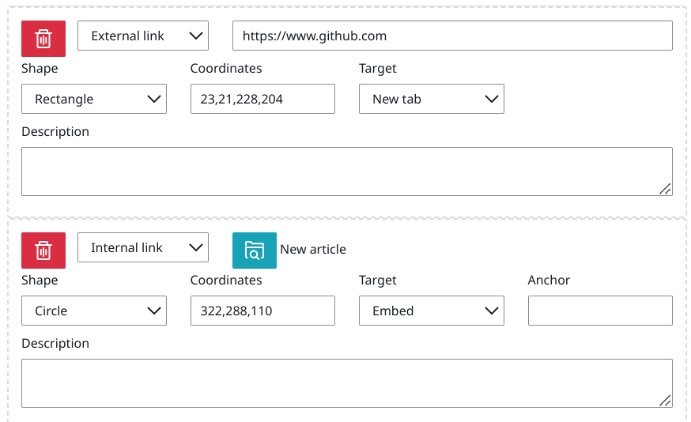

# Onisep Ibexa Imagemap Bundle

This bundle provides an image map field type for Ibexa 4.0+.

## Installation

### Add the dependency

To install this bundle, run this command :

```shell script
$ composer require onisep/ibexa-imagemap-bundle
```

### Register the bundle

Add `Onisep\IbexaImageMapBundle\OnisepImageMapBundle::class => ['all' => true],` in the `config/bundles.php` file.

### Update the database

This bundle uses Doctrine DBAL to store image map area data into the database table (`onisep_imagemap`).

If you use [Doctrine Migration Bundle](https://symfony.com/doc/master/bundles/DoctrineMigrationsBundle/index.html) 
or [Phinx](https://phinx.org/) or [Kaliop Migration Bundle](https://github.com/kaliop-uk/ezmigrationbundle) or whatever,
you can add a new migration with the generated SQL query from this command:

```shell script
$ bin/console onisep:imagemap:dump-schema
```

If you have already the tables, you can add a new migration with the generated update SQL query from this command:

```shell script
$ bin/console onisep:imagemap:dump-schema --update
```

### Build assets

To build admin assets:

```shell script
yarn encore prod --config-name=ezplatform
```

For the front assets, you need to import the bundle files in your own entry points. For example, if your entry point is 
called `app` and defined in the `assets/app.js` file, you need to add the following lines in the `assets/app.js` file:

```javascript
import '../vendor/onisep/ibexa-imagemap-bundle/src/Resources/public/build/imagemap_styles.css';
import '../vendor/onisep/ibexa-imagemap-bundle/src/Resources/public/build/imagemap';
```

Then build your assets:

```shell script
yarn encore prod --config-name=app
```

## Usage

### Creating the field

First, add the image map field to any content type, just like it is done for any other field.



You can configure the content types allowed for linking in the image map.



### Creating an image map

The image map field edit UI looks like this:



The first step is to upload an image file with the upload wiget.



Then, use the buttons to draw areas. You can draw rectangles, circles and polygons. After clicking one of the buttons, 
some help will be displayed about how to draw each shape.

Areas can be moved and resized by drag and dropping after you've drawn them.

Each area can be configured below the image.



- Link type:
  - External: simply enter the target URL in the input field
  - Internal: browse and select the target content
- Target:
  - New tab: open link in new tab
  - Same tab: open link in same tab
  - Embed (internal link only): display an embed view of the content below the image
  - Popin (internal link only): display an embed view of the content in a popin
- Anchor (embed only): custom anchor for the embed element
- Description: title HTML attribute for this area

# Issues and feature requests

Please report issues and request features at https://github.com/onisep/ibexa-imagemap-bundle/issues.

# Contributing

Contributions are very welcome. Please see [CONTRIBUTING.md](CONTRIBUTING.md) for
details. Thanks to [everyone who has contributed](https://github.com/onisep/ibexa-imagemap-bundle/graphs/contributors)
already.

# License

This package is licensed under the [MIT license](LICENSE).
